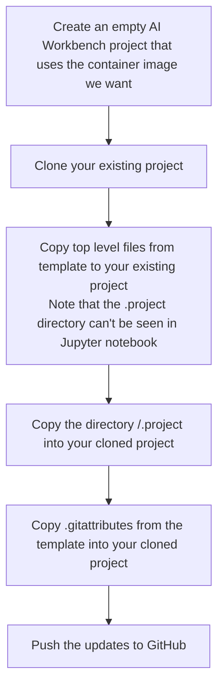

# NVidia AI Workbench

This repository was built for Jupyter Notebooks. It wasn't configured correctly to be pulled into the NVIDIA AI Workbench because that requires a few support files to configure the environment.

I created an empty Workbench project that I used as a template for updating this project. I directly copied or merged those files into this repository.



## Converting a jpynb and requirements.txt file in to an AI Workbench project

See the [project spec reference page](https://docs.nvidia.com/ai-workbench/user-guide/latest/reference/projects/spec.html#workbench-project-components) for information on the required files.

The following files were added for AI Workbench. The really important files are `requirements.txt` and the files in `.project`.  Those were copied from the template project in-toto.

| File                    | Notes                                                                                                                                      |
| ----------------------- | ------------------------------------------------------------------------------------------------------------------------------------------ |
| `/apt.txt`              | Can be empty                                                                                                                               |
| `/postBuild.bash`       | Can be empty                                                                                                                               |
| `/preBuild.bash`        | Can be empty                                                                                                                               |
| `/requirements.txt`     | This file *must* exist and be *correct* in order import a project from Github                                                              |
| `/variables.md`         | Can be empty                                                                                                                               |
| `/.gitattributes`       | LFS settings for models and data - copied from template project                                                                            |
| `/.project/configpacks` | Copied from template project                                                                                                               |
| `/.project/spec.yaml`   | Copied from template project. The name and image had to be changed to match this project rather than that of the one I used for a template |

## spec.yaml changes

The following fields were edited

```yaml
meta:
  name: my-project-template-no-cuda
  image: project-my-project-template-no-cuda
  description: Used to source files to make other repositories workbench compatible
```

to contain

```yaml
meta:
  name: covid-vaccinations-python
  image: covid-vaccinations-python
  description: Covid vaccination python exploration
```

### AI Workbanch auto added when first opened

AI Workbench did some of its own project mainainence when it first opened this project. The following files were updated.

| File               | Notes                                                            |
| ------------------ | ---------------------------------------------------------------- |
| code/.gitkeep      | make sure the directories are there for use in Jupyter notebooks |
| models/.gitkeep    | make sure the directories are there for use in Jupyter notebooks |
| .project/spec.yaml | Text wrap                                                        |
| data/README.md     | converted to LFS                                                 |

### LFS Should be enabled for models and data

No I haven't figured out the commands that AI Workbench runs.  The .gitattirbutes may be enough and the rest of this section may be noise

See [Configuring Large File Storage in GIT](https://docs.github.com/en/repositories/working-with-files/managing-large-files/configuring-git-large-file-storage)

The following said "already supported"

```shell
git lfs track "data/**"
git lfs track "models/**"
```

I think the .git/.gitconfig should end up including include

```config
[lfs]
        repositoryformatversion = 0
```
