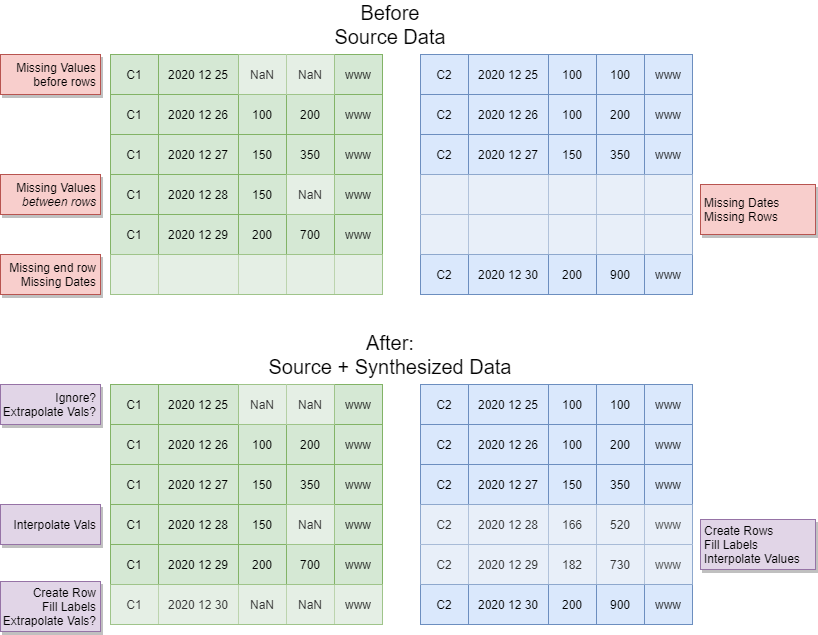

# Covid Vaccinations vs population
Tracking Covid vaccinations across the globe.  _How far have we travelled along the vaccination journey?_

## Datasets
* Our world in Data
    * https://github.com/owid/covid-19-data/tree/master/public/data/vaccinations
    * https://github.com/owid/covid-19-data/blob/master/public/data/vaccinations/vaccinations.csv
* Original vaccination dataset before I found _our world of data_  This data set combines multiple data cents from the _our world in data_ repository.
    * https://www.kaggle.com/gpreda/covid-world-vaccination-progress by https://www.kaggle.com/gpreda

## Platform
I used the Kaggle Python Container Image. You can use any _Anaaconda_ / _Jupyter Notebook_ environment.

* [Kaggle Python Container Image](https://github.com/Kaggle/docker-python) data science docker container to **rule them all**
* Any reasonable anaconda or Jupyter notebook environment _your link here_

## Genesis / Credits
* [Kenny Freeman](https://github.com/Ken-Freeman) covid project that got me interested
* [Our world in data](https://github.com/owid/covid-19-data)
* [Gabriel Preda](https://www.kaggle.com/gpreda) Kaggle datsethttps://www.kaggle.com/gpreda

## Using these files
The included bash script will download the data and run the server. You can do it yourself with
1. Make a directory in this directory called `data`
1. Download the csv file (from Github)[https://github.com/owid/covid-19-data/blob/master/public/data/vaccinations/vaccinations.csv]  and put it in `data/vaccinations.csv`
    1. Per their GitHub docs,, the right place to get this data set is (covid.ourworldindata.org)[https://covid.ourworldindata.org/data/vaccinations/vaccinations.csv]
1. Start your Jupyter server
    1. You can use any environment, local, docker, etc
    1. I use the (Kaggle Python Docker image](https://github.com/Kaggle/docker-python) by running `bash start-kaggle-container.sh` in this directory.  It will download the container **18GB** and start the Jupyter server.
1. Open `Jupyter Notebook` server.  
    1. Open a browser to http://localhost:8080/ or wherever your notbook server is locate
    1. Open and run `vaccines_demo.ipynb` in the Jupyter Notebook browser view in the left pane.

## Shutting down the server
There are a couple ways to terminate the server

1. `ctrl-c` in the terminal window and answer `Y`
1. Terminate the server in the _Jupyter Notebook_ menu in the browser window

# Demo: order of operations

Source data may be missing days and columns

We _add missing days_ and _interpolate or fill missing cell values_ `vaccines_demo.ipynb`

